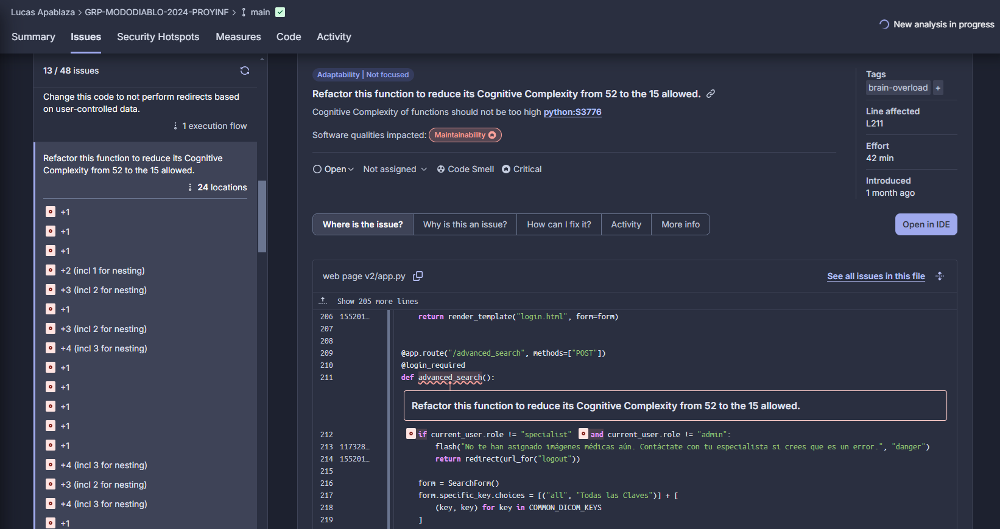

## Quality Issue 1:
**Descripción:** La función identificada tiene una complejidad cognitiva de 52, lo que excede el límite permitido de 15. La complejidad cognitiva es una métrica que mide qué tan difícil es entender y mantener el código, basado en el número de decisiones lógicas (condicionales, bucles, etc.) y el flujo general del programa. Una complejidad tan alta indica que la función es difícil de leer, probar y mantener, lo que aumenta el riesgo de errores y dificulta futuras modificaciones.

**Severidad:** Este problema tiene un gran impacto en la capacidad de mantenimiento de nuestro software.

**Evidencia:**  

